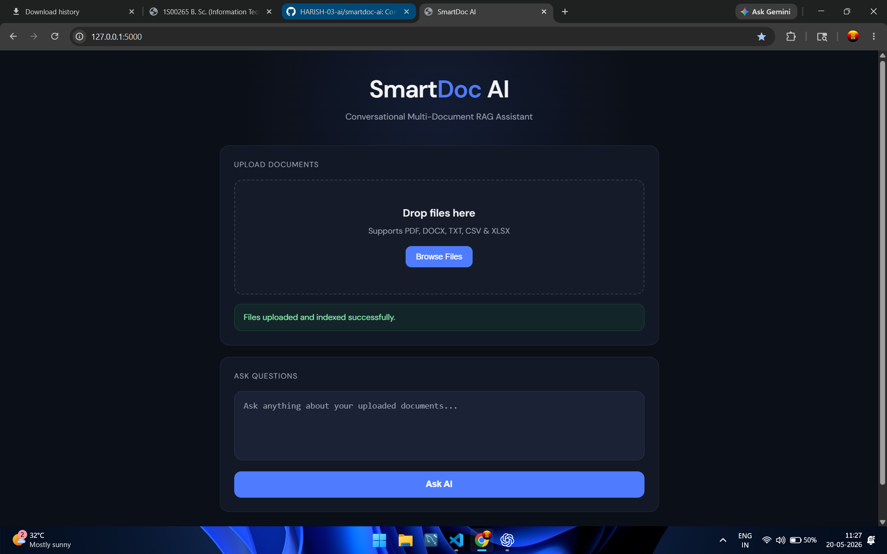
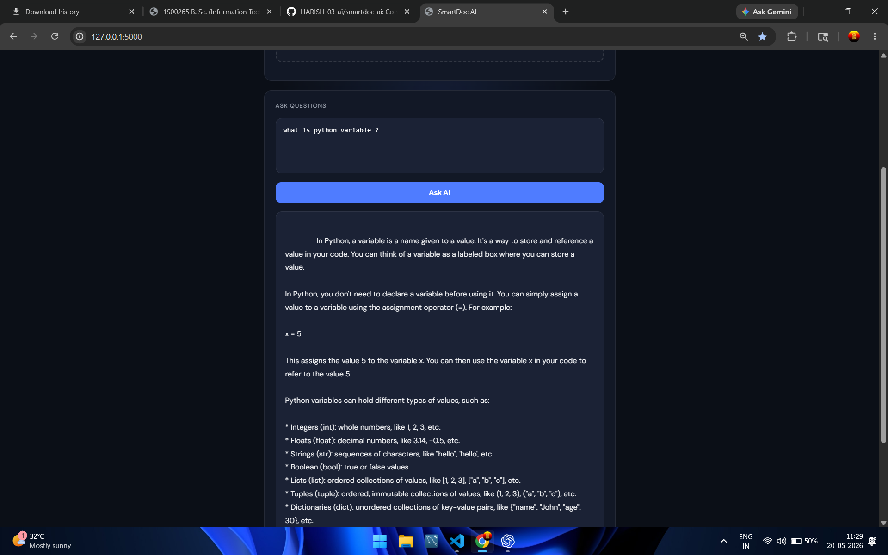

# SmartDoc AI

Conversational Multi-Document RAG Assistant built using Flask, ChromaDB and Groq LLM.

## Features

- Upload multiple documents
- Supports PDF, DOCX, TXT, CSV and XLSX
- Conversational AI chat
- RAG (Retrieval-Augmented Generation)
- Semantic search using embeddings
- Exact keyword retrieval fallback
- Chat history support
- Clean modern UI

---

## Tech Stack

- Python
- Flask
- ChromaDB
- SentenceTransformers
- Groq API
- HTML/CSS/JavaScript

---

## Project Architecture

1. Upload documents
2. Extract text from files
3. Split text into chunks
4. Generate embeddings
5. Store embeddings in ChromaDB
6. Retrieve relevant chunks
7. Send context to LLM
8. Generate AI response

---

## Challenges Faced

- Tabular PDF extraction issues
- Exact record retrieval from structured result PDFs
- Semantic retrieval limitations
- Hybrid retrieval implementation

---

## Installation

```bash
git clone https://github.com/YOUR_USERNAME/smartdoc-ai.git

cd smartdoc-ai

pip install -r requirements.txt
```

Create `.env` file:

```env
GROQ_API_KEY=your_api_key
SECRET_KEY=your_secret_key
```

Run:

```bash
python app.py
```

---

## Future Improvements

- OCR support
- Better table-aware chunking
- User authentication
- Cloud vector database
- Streaming AI responses

---

## Screenshots

### Homepage


### Upload Demo


### AI Response
